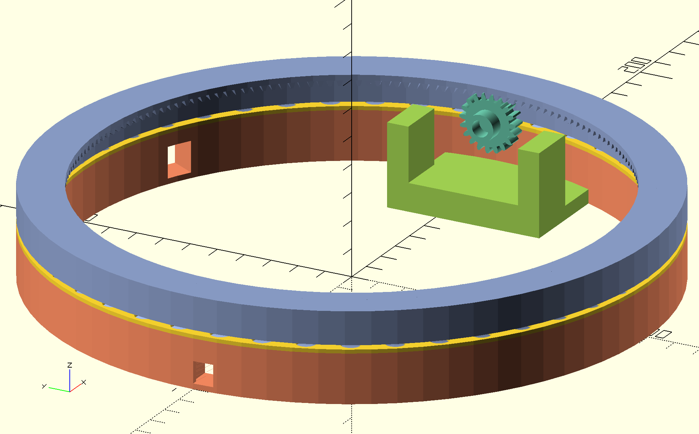
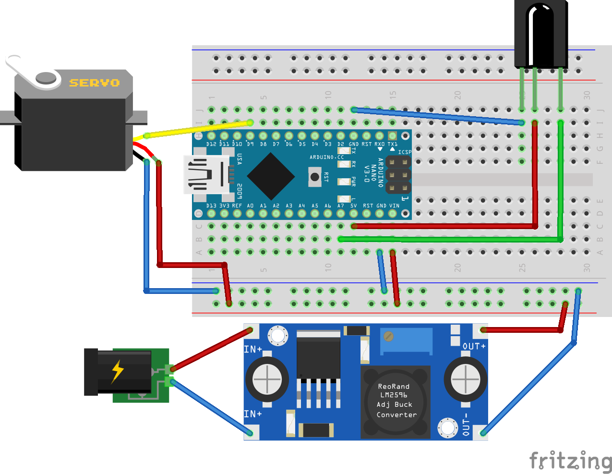

# Lazy TV

## Mk II


## Dependencies

Lazy TV uses modules from these libraries:
* https://github.com/revarbat/BOSL
* https://github.com/mcampo/scad-lib

Run the following command to download all dependencies. They will be placed in a directory named `lib`.
```console
$ ./install-dependencies.sh
```

## Wiring diagram

